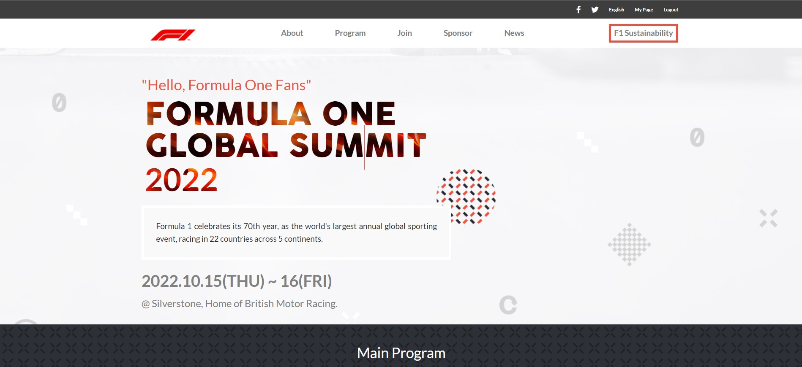
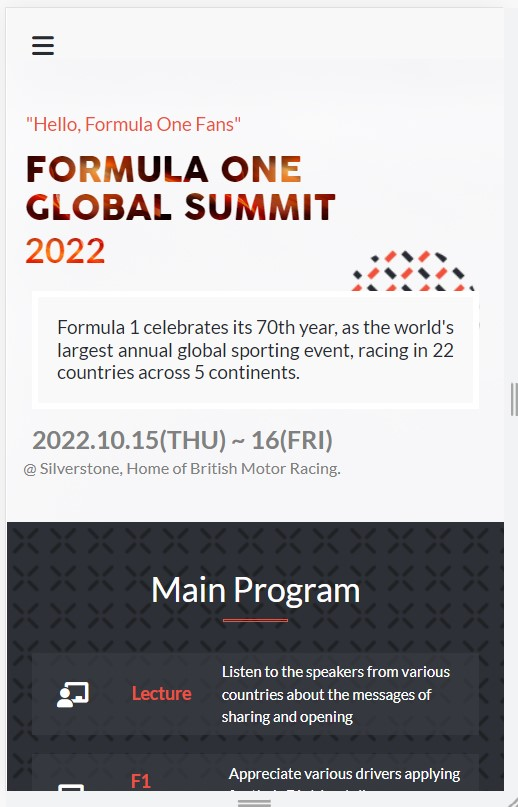

Desktop view

 Mobile view

 

<h1 align="center"> Module One Capstone Project </h1>

> This is a repository for my Module One Capstone Project at Microverse. It is a website for a fictitious, upcoming F1 Sustainability Summit.
> Visit the [Live Link](https://benmuiruri.github.io/f1-sustainability-capstone/) to view the website.
## Built With

- **HTML** and **CSS** and **Javascript**

## Getting Started

To get a local copy up and running follow these setup steps below.

### Setup

- Simply fork this project and it should be ready for you to edit as you see fit.
- In case you run into any errors please raise an [issue](https://github.com/Benmuiruri/f1-sustainability-capstone/issues).

## Authors

👤 **Author**

- GitHub: [@githubhandle](https://github.com/Benmuiruri)
- Twitter: [@twitterhandle](https://twitter.com/_optimize)
- LinkedIn: [LinkedIn](https://www.linkedin.com/in/benjamin-kiarie-180b66149/)

## 🤝 Contributing

Contributions, issues, and feature requests are welcome!

Feel free to check the [issues page](https://github.com/Benmuiruri/f1-sustainability-capstone/issues).

## Show your support

Give a ⭐️ if you like this project!

## Acknowledgments and Attribution

- The design has been inspired by [Cindy Shin](https://www.behance.net/adagio07) design on Behance.

## 📝 License

This project is [MIT](https://opensource.org/licenses/MIT) licensed.
